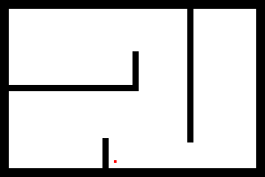
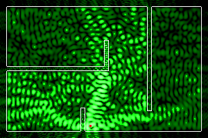

# `helmhurts-python`
Solving the Helmholtz equation to model the amplitude field of wireless (in Python),
with Dirichlet conditions on the boundaries and some diffusive term for the walls.

## Install

```bash
# clone
git clone https://github.com/pierre-24/helmhurts-python
cd helmhurts-python

# create venv
python3 -m venv venv
source ./venv/bin/activate

# install dependancies
pip3 install -r requirements.txt
```

## For example

The following floor plan:



should be used as

```
$ python3 ./power_map.py test.png
f = 2.400 GHz → λ = 0.1249m → k = 50.300
Computing ... done!
```

and gives the following output (spacial resolution: 1px → 1cm):



Different options exists to control the input (such as the color of the wall and of the source) and the output:

```
$ python ./power_map.py --help
usage: power_map.py [-h] [-v] [-m MIN] [-M MAX] [-p POWER] [-f FREQUENCY]
                    [-r RESOLUTION] [-w WALL_REFRACTIVE] [-d WALL_DIFFUSIVE]
                    [--alayer-thickness ALAYER_THICKNESS]
                    [--alayer-diffusive ALAYER_DIFFUSIVE]
                    [--wall-color-in WALL_COLOR_IN]
                    [--wall-color-out WALL_COLOR_OUT]
                    [--source-color-in SOURCE_COLOR_IN]
                    [--source-color-out SOURCE_COLOR_OUT]
                    [--power-map-c POWER_MAP_C]
                    input

Compute the field generated by a Wi-Fi (or any other equipment that emits E.M. wave
in the GHz range). Expects an image as input, where the color of the wall is given
by `--wall-color-in` (default = black), and the color of the source is given by
`--source-color-in` (default = red).

positional arguments:
  input                 Map of the walls

options:
  -h, --help            show this help message and exit
  -v, --version         show program's version number and exit
  -m MIN, --min MIN     Floor value of power (in dB)
  -M MAX, --max MAX     ceil value of power (in dB)
  -p POWER, --power POWER
                        power of the source (in V/m²?)
  -f FREQUENCY, --frequency FREQUENCY
                        frequency of the wave (in GHz)
  -r RESOLUTION, --resolution RESOLUTION
                        spacial resolution (in m)
  -w WALL_REFRACTIVE, --wall-refractive WALL_REFRACTIVE
                        refractive index of the walls
  -d WALL_DIFFUSIVE, --wall-diffusive WALL_DIFFUSIVE
                        diffusive power of wall (in S/m)
  --alayer-thickness ALAYER_THICKNESS
                        thickness of absorption layer
  --alayer-diffusive ALAYER_DIFFUSIVE
                        diffusive power of absorption layer (in S/m)
  --wall-color-in WALL_COLOR_IN
                        color of the walls in input
  --wall-color-out WALL_COLOR_OUT
                        color of the contour of the walls in output
  --source-color-in SOURCE_COLOR_IN
                        color of the sources in input
  --source-color-out SOURCE_COLOR_OUT
                        color of the sources in output
  --power-map-c POWER_MAP_C
                        map color shade
```

## Sources

+ https://jasmcole.com/2014/08/25/helmhurts/ (the original article)
+ https://github.com/mwil/helmhurts
+ https://bthierry.pages.math.cnrs.fr/course-fem/projet/2017-2018/
+ https://dx.doi.org/10.1002/net.22116
